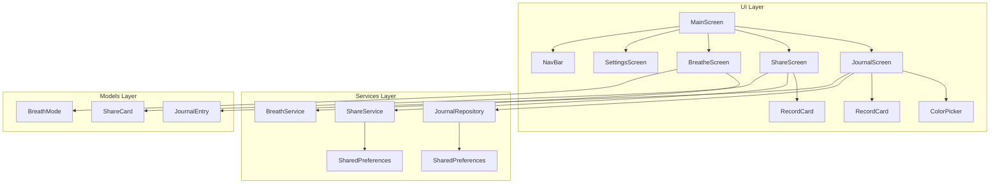

# Azenquoria App - 设置指南

## 项目概述

Azenquoria 是一款集日记记录、内容分享和呼吸调节于一体的生活辅助应用。应用采用了现代化的深色主题设计，提供了四个主要功能模块：

1. **生活记录**：记录日常生活，选择配色方案，生成记录卡片
2. **分享瞬间**：创建短文本分享卡片，生成二维码，方便分享
3. **呼吸调节**：提供多种呼吸练习模式，帮助用户放松、集中注意力
4. **设置**：用户信息和应用设置

## 安装步骤

1. 确保已安装 Flutter SDK (版本 3.8.1 或更高)
2. 克隆此仓库到本地
3. 运行以下命令安装依赖:

```bash
flutter pub get
```

4. 运行应用:

```bash
flutter run
```

## 项目结构

项目采用清晰的分层架构，文件组织如下:

```
lib/
├── main.dart                  # 应用入口点
├── models/                    # 数据模型
│   ├── breath_mode.dart       # 呼吸模式模型
│   ├── journal_entry.dart     # 日记条目模型
│   └── share_card.dart        # 分享卡片模型
├── screens/                   # 界面
│   ├── breathe_screen.dart    # 呼吸调节界面
│   ├── journal_screen.dart    # 生活记录界面
│   ├── settings_screen.dart   # 设置界面
│   └── share_screen.dart      # 分享瞬间界面
├── services/                  # 服务
│   ├── breath_service.dart    # 呼吸调节服务
│   ├── journal_repository.dart # 日记存储服务
│   └── share_service.dart     # 分享服务
└── widgets/                   # 可复用组件
    ├── color_picker.dart      # 颜色选择器
    ├── nav_bar.dart           # 底部导航栏
    └── record_card.dart       # 记录卡片组件
```

## 架构图

下图展示了应用的整体架构和各组件之间的关系:



## 使用的依赖

- **font_awesome_flutter**: 提供丰富的图标
- **shared_preferences**: 本地数据存储
- **uuid**: 生成唯一标识符

## 设计风格

应用采用深色主题，主要颜色包括:

- 深蓝色背景 (`#0A0F1F`)
- 干邑橙色作为主色调 (`#D97C29`)
- 青色作为次要色调 (`#4FC1B9`)
- 紫色作为第三色调 (`#9B5DE5`)

界面设计注重视觉吸引力和用户体验，包括圆角卡片、渐变效果和微妙的动画。 